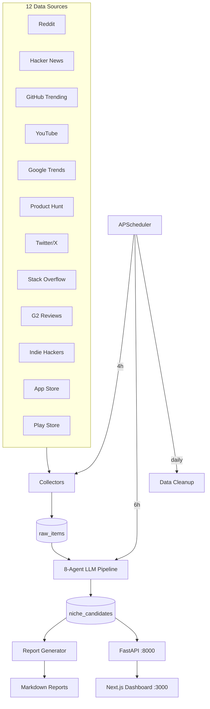
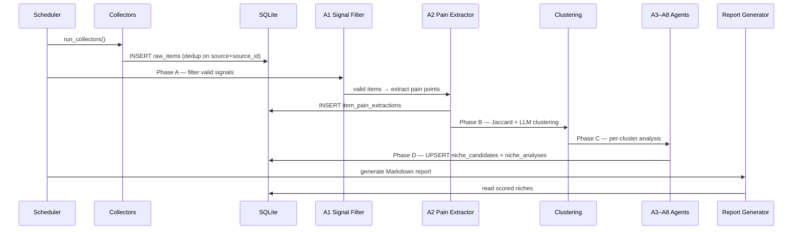

<!-- generated: 2026-05-22 -->
# Architecture

## Overview

Niche Radar is a self-hosted trend-intelligence pipeline that ingests content from 12 public platforms, runs an 8-agent LLM analysis pipeline to discover emerging product opportunities, and serves results through a FastAPI backend + Next.js dashboard. SQLite is the default data store; the system is designed for single-instance deployment via Docker Compose.

## Modules

### Collectors (`niche_radar/collectors/`)
- **Role**: Fetch, normalise, and store raw items from each external platform
- **Interface**: `BaseCollector.collect(dry_run) → CollectorResult`
- **Key files**: `base.py` (abstract base + CollectorResult), one module per source

### Agent Pipeline (`niche_radar/agents/`)
- **Role**: Transform raw items into scored niche candidates via 8 LLM agents across 4 phases
- **Interface**: `run_analysis(db_path, settings, dry_run) → dict`
- **Key files**: `pipeline.py` (orchestration), `orchestrator.py` (per-cluster agents), `models.py` (A1–A8 Pydantic models), `clustering.py`, `prompts.py`

### LLM Clients (`niche_radar/llm/`)
- **Role**: Abstraction over LLM providers (OpenAI-compatible, Anthropic)
- **Interface**: `LLMClient.chat(messages, model, response_format) → str`
- **Key files**: `base.py`, `openai_compat.py`, `anthropic_client.py`

### Storage (`niche_radar/storage/`)
- **Role**: SQLite database operations — schema creation, CRUD, retention cleanup
- **Interface**: Repository functions called directly by collectors, pipeline, and API
- **Key files**: `repository.py`, `cleanup.py`

### API Server (`niche_radar/api/`)
- **Role**: FastAPI REST API serving niche data, pipeline control, settings management
- **Interface**: 23 HTTP endpoints on port 8000
- **Key files**: `server.py`, `jobs.py` (in-memory job manager)

### Frontend (`frontend/`)
- **Role**: Next.js 14 dashboard with SWR data fetching, xAI-inspired dark design system
- **Interface**: 9 page routes, proxy to backend via `/api/[...proxy]`
- **Key files**: `src/app/page.tsx` (dashboard), `src/lib/api.ts`, `src/lib/types.ts`

### Scheduler (`niche_radar/scheduler.py`)
- **Role**: Background job scheduling — collection every 4h, analysis every 6h, daily cleanup
- **Interface**: `start_scheduler(settings)` called from `serve` command

## Core Flows

### Opportunity Discovery (collect → analyse → report)

## Data Model

Core tables: `collection_runs` → `raw_items` → `item_pain_extractions` (A1+A2 results) → `niche_item_links` → `niche_candidates` → `niche_analyses` (A3–A8 results). User curation via `shortlist_notes`. Settings in `app_settings`.

## Infrastructure

- **Backend**: Python 3.11+, FastAPI + Uvicorn on port 8000
- **Frontend**: Next.js 14 on port 3000, proxies `/api/*` to backend
- **Database**: SQLite at `data/niche_radar.db` (PostgreSQL optional via Docker Compose profile)
- **Scheduler**: APScheduler BackgroundScheduler, embedded in `serve` command
- **Container**: Docker Compose with `radar` (backend), `frontend`, and optional `db` (Postgres) services
- **LLM**: Pluggable — OpenAI, DeepSeek, Groq, Ollama, Anthropic via configurable provider

## Key Decisions

- **SQLite as default store**: Zero-dependency deployment; PostgreSQL available as opt-in profile for scale
- **8 separate LLM agents vs. monolithic prompt**: Each agent has focused structured output (Pydantic models), enabling parallel execution and graceful partial failure
- **Jaccard + LLM hybrid clustering**: Deterministic pre-grouping for speed, LLM refinement only for large clusters (≥4 items) to control cost
- **Budget-capped LLM calls**: Formula `2N + 10C + 50` prevents runaway API spend
- **Frontend proxy pattern**: Next.js catch-all route proxies to backend, avoiding CORS complexity
