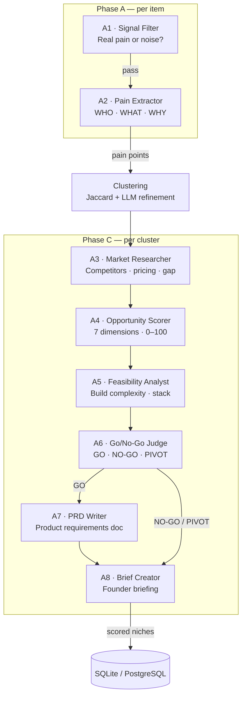

<div align="center">

# Niche Radar

*Automated trend-intelligence pipeline for discovering product opportunities*


[Overview](#overview) • [Quick Start](#quick-start) • [Dashboard](#dashboard) • [Data Sources](#data-sources) • [LLM Providers](#llm-providers) • [Architecture](#architecture) • [Development](#development)

</div>

---

## Overview

Niche Radar monitors **12 public platforms**, runs an **8-agent LLM analysis pipeline**, and delivers scored niche candidates through a web dashboard — so you don't have to manually scan Reddit, HN, Twitter, and YouTube for product ideas every day.

**The pipeline in one line:**

```
12 Sources → Collect (4h cycle) → 8-Agent LLM Pipeline (6h cycle) → Scored Niches → Dashboard
```

### The 8-Agent Pipeline



<details>
<summary>Full-color pipeline diagram (SVG)</summary>


</details>

| Agent | Role |
|-------|------|
| **A1** Signal Filter | Drops noise, keeps genuine pain signals |
| **A2** Pain Extractor | Extracts user frustrations with verbatim quotes |
| **A3** Market Researcher | Analyses market size and competition |
| **A4** Opportunity Scorer | Scores across 7 dimensions (0–100) |
| **A5** Feasibility Analyst | Estimates build complexity and stack |
| **A6** Go/No-Go Judge | Issues GO, NO-GO, or PIVOT verdict |
| **A7** PRD Writer | Generates a product requirements document (GO only) |
| **A8** Brief Creator | Produces a concise founder briefing |

### Opportunity Scoring Dimensions

Each niche is scored across 7 dimensions (1–10 each), combined into a weighted 0–100 score:

| Dimension | Default Weight | What It Measures |
|-----------|---------------|------------------|
| Problem Clarity | 1.0 | How clearly defined and specific the user pain is |
| Market Size | 1.5 | TAM/SAM estimation from market signals |
| Willingness to Pay | 2.0 | Evidence of users paying for similar solutions |
| Competition Gap | 1.5 | How underserved the niche currently is |
| Technical Feasibility | 1.0 | Complexity to build an MVP |
| Distribution Clarity | 1.5 | How easy it is to reach the target audience |
| Trend Momentum | 1.0 | Growth trajectory of the problem space |

Weights are customizable from **Settings → Scoring Weights** in the dashboard.

## Quick Start

### Prerequisites

- [Docker](https://docs.docker.com/get-docker/) and [Docker Compose](https://docs.docker.com/compose/install/)
- An LLM API key (DeepSeek, OpenAI, Anthropic, Groq, xAI, Google Gemini — or a local [Ollama](https://ollama.com/) instance)

### 1. Clone and configure

```bash
git clone https://github.com/affectionatec/niche-radar-alpha.git
cd niche-radar-alpha
cp .env.example .env
```

Edit `.env` with your LLM key:

```env
LLM_API_KEY=sk-your-key-here
LLM_BASE_URL=https://api.deepseek.com
LLM_MODEL=deepseek-v4-flash
```

### 2. Start

```bash
docker compose up -d --build
```

| Service | URL | Description |
|---------|-----|-------------|
| **radar** | [localhost:8000](http://localhost:8000) | FastAPI backend + scheduler |
| **frontend** | [localhost:3000](http://localhost:3000) | Next.js dashboard |

> [!TIP]
> Data persists in `./data/` (SQLite) and `./reports/` (generated reports) via Docker volumes. Pipeline run history and discovered opportunities survive rebuilds.

### 3. Open the dashboard

Visit **http://localhost:3000**. If no LLM key is configured yet, you'll be redirected to the Settings page.

> [!NOTE]
> **Want PostgreSQL instead of SQLite?** Run with the postgres profile:
> ```bash
> docker compose --profile postgres up -d --build
> ```
> Then set `DATABASE_URL=postgresql://radar:changeme@db:5432/niche_radar` in `.env`.

## Dashboard

<!-- TODO: Add screenshots when the instance is running -->
<!-- Screenshots: Home page, Niches list, Niche Detail with score breakdown -->

| Page | What it does |
|------|-------------|
| **Home** | System health across all 12 sources, data freshness, collection stats |
| **Niches** | Sortable table of scored candidates with LLM score, verdict, momentum |
| **Niche Detail** | Full scoring breakdown per dimension, agent reasoning chain (A4→A5→A6), web validation, generated PRD |
| **Shortlist** | User-curated starred opportunities |
| **Pipeline** | Visual stage-by-stage workflow, agent activity feed, A/B run comparison |
| **Cost** | LLM token usage by agent, daily spend chart, per-run cost breakdown |
| **Reports** | Browse generated Markdown analysis reports |
| **Settings** | LLM provider config (8 providers, live model refresh), scoring weights, prompt packs, data source credentials |

> [!TIP]
> See [sample reports](docs/sample-reports/) for examples of pipeline output — including a 🟢 GO verdict with full PRD and a 🔴 NO-GO verdict with detailed rationale.

## Data Sources

| Source | Method | Credentials | Reliability |
|--------|--------|-------------|-------------|
| Reddit | PRAW (official API) | Client ID + Secret ([free](https://www.reddit.com/prefs/apps)) | 🟢 Stable |
| Hacker News | Firebase + Algolia API | None | 🟢 Stable |
| GitHub Trending | REST API | None (optional PAT) | 🟢 Stable |
| YouTube | Data API v3 | None | 🟢 Stable |
| Stack Overflow | Official API v2.3 | None | 🟢 Stable |
| Google Trends | pytrends (unofficial) | None | 🟡 Fragile |
| Product Hunt | GraphQL API | None | 🟡 Fragile |
| App Store | iTunes API / scraping | None | 🟡 Fragile |
| Play Store | google-play-scraper | None | 🟡 Fragile |
| G2 Reviews | HTML scraping | None | 🟠 Brittle |
| Indie Hackers | HTML scraping | None | 🟠 Brittle |
| Twitter / X | GraphQL + cookie auth | Cookie auth | 🔴 Very Brittle |

> [!TIP]
> Most sources work out of the box with zero credentials. All source credentials can be managed from **Settings → Data Sources** in the dashboard.

## LLM Providers

8 providers supported — select and configure from the dashboard. The model list can be live-refreshed from the provider's API.

| Provider | Example Models |
|----------|---------------|
| **DeepSeek** | `deepseek-v4-flash`, `deepseek-v4-pro` |
| **OpenAI** | `gpt-5.2`, `gpt-4.1-mini`, `o3` |
| **Anthropic** | `claude-sonnet-4-6`, `claude-opus-4-7` |
| **Groq** | `llama-3.3-70b-versatile`, `qwen3-32b` |
| **Google Gemini** | `gemini-3.1-pro`, `gemini-2.5-flash` |
| **xAI (Grok)** | `grok-4.3` |
| **Ollama** | Any local model (`llama3.3`, `phi4`, …) |
| **Custom** | Any OpenAI-compatible endpoint |

## Architecture

```
┌──────────────────────────────────────────────────────┐
│                   Docker Compose                      │
│                                                       │
│  ┌──────────────────┐     ┌────────────────────────┐  │
│  │  frontend :3000   │────▶│    radar :8000          │  │
│  │  Next.js 14       │     │    FastAPI + Uvicorn    │  │
│  │  React 18, SWR    │     │    APScheduler          │  │
│  └──────────────────┘     │    8-Agent Pipeline      │  │
│                            │    12 Collectors         │  │
│                            └──────────┬──────────┘   │
│                                       │               │
│                            ┌──────────▼──────────┐   │
│                            │  SQLite (./data/)    │   │
│                            │  Reports (./reports/)│   │
│                            └─────────────────────┘   │
└──────────────────────────────────────────────────────┘
```

### Project Structure

```
niche-radar-alpha/
├── docker-compose.yml              # Primary deployment
├── Dockerfile                      # Backend container
├── .env.example                    # Env var template
├── CONTEXT.md                      # Domain glossary
├── niche_radar/                    # Python backend
│   ├── collectors/                 # 12 data source collectors
│   ├── agents/                     # 8-agent LLM pipeline
│   │   ├── pipeline.py             #   Phase A–D orchestration
│   │   ├── models.py               #   A1–A8 Pydantic I/O
│   │   ├── prompts.py              #   Agent system prompts + prompt pack loader
│   │   └── clustering.py           #   Jaccard + LLM clustering
│   ├── llm/                        # LLM client abstraction + usage tracking
│   ├── eval/                       # Golden set evaluation framework
│   ├── storage/                    # SQLite/PostgreSQL repository
│   ├── api/                        # FastAPI server + job manager
│   └── reports/                    # Markdown report generator
├── frontend/                       # Next.js dashboard
│   ├── Dockerfile                  # Frontend container
│   └── src/
│       ├── app/                    # Page routes (11 pages)
│       ├── components/             # Shared UI components
│       └── lib/                    # API client, types, design tokens
├── prompt_packs/                   # YAML-based prompt override packs
├── eval/                           # Golden set data for pipeline evaluation
├── docs/                           # Extended documentation
│   ├── ARCHITECTURE.md             # System design, module map, clustering strategy
│   ├── AGENTS.md                   # Agent design philosophy + prompt documentation
│   ├── MONETIZATION.md             # Monetization strategies + deployment guide
│   ├── PRODUCT.md                  # Problem statement & features
│   ├── DESIGN.md                   # UI/UX design system
│   ├── spec.md                     # Full MVP specification
│   └── images/                     # Diagrams and assets
└── tests/                          # pytest suite
```

## Configuration

Key environment variables (see [`.env.example`](.env.example) for the full list):

| Variable | Default | Description |
|----------|---------|-------------|
| `LLM_PROVIDER` | `openai_compat` | `openai_compat` or `anthropic` |
| `LLM_API_KEY` | — | Your LLM provider API key |
| `LLM_BASE_URL` | — | API endpoint (empty = OpenAI default) |
| `LLM_MODEL` | `deepseek-v4-flash` | Model name |
| `DATABASE_URL` | `sqlite:///data/niche_radar.db` | SQLite or PostgreSQL URL |
| `COLLECTION_INTERVAL_HOURS` | `4` | Hours between collection cycles |
| `ANALYSIS_INTERVAL_HOURS` | `6` | Hours between analysis runs |

> [!IMPORTANT]
> All settings can also be configured from the web dashboard's **Settings** page — no `.env` editing required after initial setup.

### Clustering Configuration

The clustering algorithm (Phase B) is configurable via environment variables:

| Variable | Default | Description |
|----------|---------|-------------|
| `NR_JACCARD_THRESHOLD` | `0.25` | Minimum keyword overlap to cluster items |
| `NR_CLUSTER_LLM_MIN_SIZE` | `3` | Minimum cluster size for LLM refinement |
| `NR_CLUSTER_LLM_MAX_ITEMS` | `40` | Max items per LLM refinement batch |
| `NR_CLUSTER_LLM_TEMP` | `0.2` | Temperature for clustering LLM calls |

## Prompt Packs

Prompt packs customize how agents evaluate niches for different audiences. Three built-in packs are included:

| Pack | Focus | Key Rules |
|------|-------|-----------|
| `indie_hacker` | Solo-founder economics | Build feasibility ↑, market size ↓, no funding required |
| `vc_scout` | Venture-scale opportunities | TAM > $100M required, defensibility ↑, network effects |
| `service_business` | Agency / consulting | Distribution ease ↑, recurring revenue, templatable delivery |

Packs live in `prompt_packs/` as YAML files. Create your own by defining `overrides` per agent:

```yaml
name: my_pack
description: "Custom evaluation lens"
overrides:
  a4:
    append: |
      Adjust scoring weights: build_feasibility = 0.25, market_size = 0.10
  a6:
    append: |
      If monthly revenue < $5,000, lean NO-GO
```

View available packs from **Settings → Prompt Packs** in the dashboard.

## Cost Tracking

Every LLM call is automatically tracked — tokens, cost, and agent attribution. Visit the **Cost** page to see:

- Total prompt/completion tokens across all runs
- Per-agent usage breakdown (which agents consume the most)
- Daily usage chart
- Per-pipeline-run cost breakdown

## CLI Reference

The backend exposes CLI commands. Inside Docker, these run automatically via the scheduler, but you can run them manually:

```bash
docker exec niche-radar python -m niche_radar <command>
```

| Command | Description |
|---------|-------------|
| `serve` | Start API server + background scheduler *(default)* |
| `collect [--source NAME]` | Run collection from all or a specific source |
| `analyze [--test]` | Run the 8-agent LLM analysis pipeline |
| `report` | Generate a Markdown analysis report |
| `cleanup` | Run data retention cleanup |
| `status` | Show system health summary |

## Development

> [!NOTE]
> Docker Compose is the primary way to run Niche Radar. Use local development only if you're contributing to the codebase.

```bash
# Backend
python -m venv .venv && source .venv/bin/activate
pip install -r requirements.txt
cp .env.example .env
python -m niche_radar serve    # API on :8000

# Frontend (separate terminal)
cd frontend && npm install && npm run dev    # Dashboard on :3000
```

### Running tests

```bash
pip install -e ".[dev]"
pytest -v
```

## Further Reading

| Document | Description |
|----------|-------------|
| [CONTEXT.md](CONTEXT.md) | Domain glossary — canonical terms used in the codebase |
| [ARCHITECTURE.md](docs/ARCHITECTURE.md) | System design, module map, clustering strategy |
| [AGENTS.md](docs/AGENTS.md) | Agent design philosophy, prompts, failure cases |
| [PRODUCT.md](docs/PRODUCT.md) | Problem statement, users, features, non-goals |
| [DESIGN.md](docs/DESIGN.md) | UI/UX design system (xAI-inspired dark theme) |
| [MONETIZATION.md](docs/MONETIZATION.md) | Monetization strategies and deployment guide |
| [spec.md](docs/spec.md) | Full MVP specification |
| [Sample Reports](docs/sample-reports/) | Example pipeline output (GO + NO-GO verdicts) |
